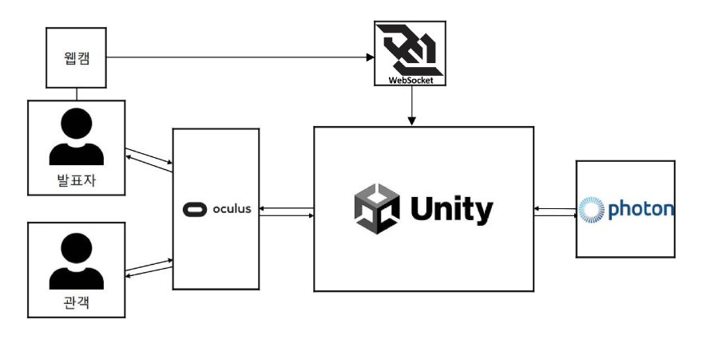

  

  
  
  
  
  

---

## 📝 **작품 개요**
VR 발표 연습 시뮬레이션은 현실에서 발표 연습을 하기 어려운 사람들을 위해, 언제 어디서든 몰입감 있게 발표를 연습할 수 있도록 개발된 VR 콘텐츠입니다.
이 콘텐츠는 연습 모드와 실습 모드로 구성되어 연습 모드에서는 간단한 적응 훈련(시선 응시 연습)과, 실습 모드에서는 가상환경 속에서 발표자와 최대 2명의 청중을 1:N으로 연결해 실제 발표처럼 연습할 수 있는 기능을 제공합니다.

## 🧩 **작품 구조**

## 👥 **팀 구성**
- 팀장
  노하은(1971020)
  > 기획 총괄, 모션 트래킹 구현
- 팀원
  + 이정혁(1871407)
    > 스크립트 구현 
  + 심혜진(2171454)
    > 그래픽 구현

## 💡 **Reference**
- Motion tracking 
  [Move Unity humanoid avatar](https://github.com/rlsid/rotate-unity-avatar-joint) 
  [Pose landmark detection guide for Python](https://ai.google.dev/edge/mediapipe/solutions/vision/pose_landmarker/python?hl=ko) 

- Markdown custom 
  [Dynamic Coloful Image Render](https://github.com/kyechan99/capsule-render/tree/master) 
  [badges](https://shields.io/) 
  [Simpleicons](https://simpleicons.org/)

---

# 시연 영상

https://drive.google.com/file/d/1N-janITLHQsT6kL0-s5QKOE_VjvpVn6N/view?usp=sharing
